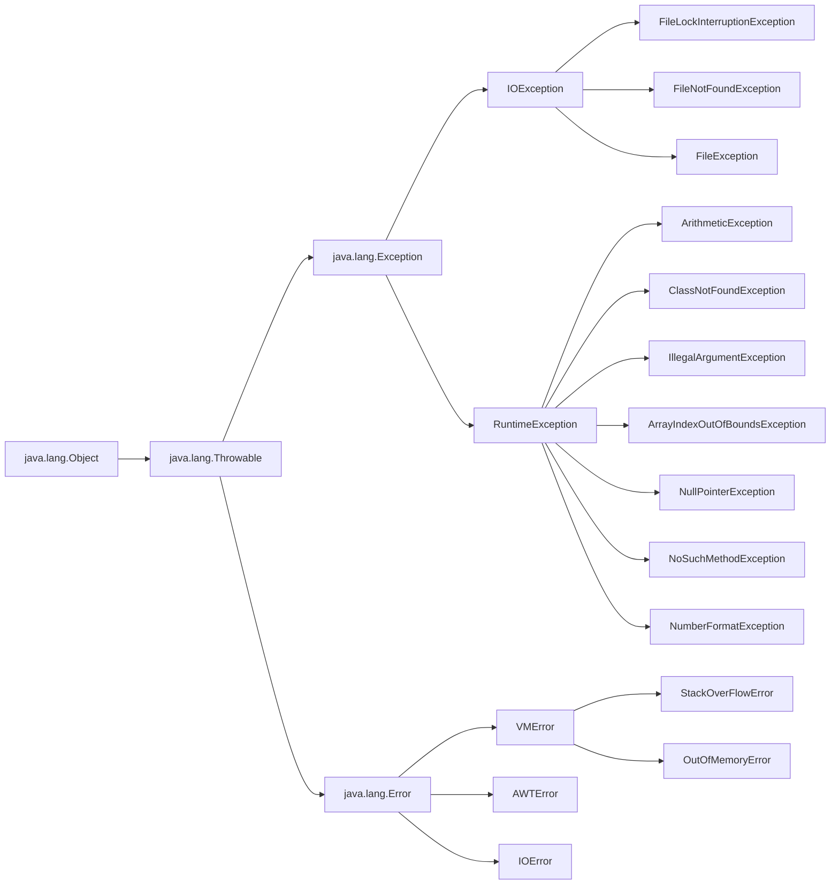

### 异常

Java 中的错误大致分为两个

1. 异常
    1. 编译时异常（通常是 IOException 和自定义异常）
    2. 运行时异常（通常是代码逻辑错误导致，RuntimeException）
 2. 错误（Error，通常为系统硬件故障，如硬件资源不足）

Java 中将运行时异常抽象成了对象，用来描述各种不同的运行时异常，叫做异常类

当程序出现错误时，Java 会自动创建一个对象，用来描述该错误的信息，并且系统会将该对象交给能够处理这个异常的代码进行处理

#### Error 和 Exception

Error 指的是系统错误，程序无法进行处理（栈溢出等系统级错误）

Exception 指的是程序运行时出现的错误，程序可以对其进行处理（空指针异常等源代码逻辑错误）

	1. RuntimeException 运行时异常可以不用手动处理 unchecked exception，系统有默认处理的方法（e.printStackTrace()）
 	2. IOException 或者自定义异常为受检查异常 checked exception，系统会要求手动处理，throws 或 try-catch

#### try-catch

```java
public class MyException {
    public static void main(String[] args) {
        int[] array = new int[]{1, 2, 3};

        try {
            //try 中捕获可能发生的异常
            System.out.println(array[3]);
        } catch (Exception e) {
            //catch 中处理发生的异常
            e.printStackTrace();
        } finally {
            System.out.println("最后一定执行");
        }
    }
}
```

默认情况对异常的方法调用栈进行打印`e.printStackTrace()`，帮助排查错误

finally 为可选，追加在 catch 后，finally 中的代码一定会执行（即使 try-catch 中有 return 操作），通常用来关闭 try 中创建的资源、连接等

#### 异常类



#### throw 和 throws

Java 有三种处理异常的方式

1. try-catch （捕获异常）
2. throw （创造异常）`throw new IOException;`

3. throws （抛出异常）在方法参数括号后声明，用来表示一个方法可能会抛出异常

```java
public class ThrowException {

    public void method() throws IOException {
        throw new IOException();
    }

    public static void main(String[] args) {

        ThrowException throwException = new ThrowException();
        try {
            throwException.method();
        } catch (IOException e) {
            e.printStackTrace();
        }
    }
}
```

#### 自定义异常

```java
public class CustomizedException extends Exception {
    
    public CustomizedException(String message) {
        super(message);
    }

    public static void main(String[] args) throws CustomizedException {
        CustomizedException customizedException = new CustomizedException("自定义异常");
        throw customizedException;
    }
}

Exception in thread "main" test.CustomizedException: 自定义异常
	at test.CustomizedException.main(CustomizedException.java:8)
```

