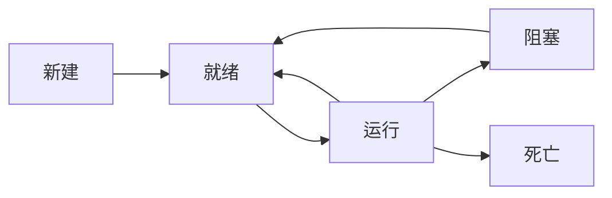

[TOC]

### 多线程

优点：提升程序性能的一种方式，可以充分利用 CPU 的使用率，使程序的运行效率更高

缺点：需要更多的内存空间，可能会有数据不一致的情况（线程不安全），可能存在资源竞争造成死锁的情况

#### 相关概念

##### 串行&并发&并行

* 串行：一个事情完成后才能做下一件事

* 并发：单核 CPU，在一个时间段内有多件事发生（交替执行）

* 并行：多核 CPU，在同一时刻可以做多件事

##### 进程&线程

* 进程：拥有独立的内存空间，是计算机正在运行的一个独立的应用程序（进程是动态的，若没有应用程序运行，则不存在进程）
* 线程：共用进程的内存空间，每个线程的执行都是独立的，线程是组成进程的基本单位，线程依赖于进程的启动，可以完成特定的功能，一个进程是由一个或多个线程组成的

##### 多线程

线程的并发，在一个时间段内多个线程交替执行，系统会为每个线程分配 CPU 资源，在不同的时间段 CPU 被不同的线程占用，由于占用时间短，线程的执行速度又很快，所以看起来像是同时执行

#### 创建线程

1. 实现 Runnable 接口

   ```java
   public class MyRunnable implements Runnable {
   
       @Override
       public void run() {
   
           for (int i = 0; i < 100; i++) {
               System.out.println("myRunnable 线程执行：" + i);
           }
       }
   
       public static void main(String[] args) {
   
           MyRunnable myRunnable = new MyRunnable();
   
           Thread thread1 = new Thread(myRunnable);
           Thread thread2 = new Thread(myRunnable);
   
           thread1.start();
           thread2.start();
       }
   }
   ```

2. 继承 Thread 类（不推荐使用，因为 Java 是单继承的，继承了 Thread 就不能继承其它的类了）

   ```java
   public class MyThread extends Thread {
   
       @Override
       public void run() {
   
           for (int i = 0; i < 100; i++) {
               System.out.println("myThread 线程执行：" + i);
           }
       }
   
       public static void main(String[] args) {
   
           MyThread thread1 = new MyThread();
           MyThread thread2 = new MyThread();
   
           thread1.start();
           thread2.start();
       }
   }
   ```

   实际 Thread 类也实现了 Runnable 接口，Thead 表示线程，Runnable 表示线程中要执行的任务内容

   启动线程需要调用 Thread 类的 start() 方法，而不是 run() 方法，start() 表示线程的启动，是 Thread 类的，而 run() 是 Runnable 接口中的，表示任务的执行，单独使用 run() 不会使线程去争夺 CPU 资源

3. 实现 Callable 接口

   ```java
   public class MyCallable implements Callable {
   
       @Override
       public Object call() throws Exception {
           return "Callable";
       }
   
       public static void main(String[] args) throws ExecutionException, InterruptedException {
   
           MyCallable myCallable = new MyCallable();
           FutureTask futureTask = new FutureTask(myCallable);
   
           Thread thread = new Thread(futureTask);
           thread.start();
   
           System.out.println(futureTask.get());
       }
   }
   ```

   Callable 接口与 Runnable 接口的区别在于：Callable 可以有返回值，可以抛出异常

#### 线程的五个状态



1. **新建（New）**
   线程对象被创建后就进入了新建状态。
   Thread thread = new Thread()

2. **就绪状态（Runnable）**
   也被称为“可执行状态”。线程对象被创建后，其他线程调用了该对象的start()方法，从而启动该线程。
   thread.start() ; 处于就绪状态的线程随时可能被CPU调度执行。

3. **运行状态（Running）**
   线程获取CPU权限进行执行，执行 run() 方法。需要注意的是，线程只能从就绪状态进入到运行状态，也可以从运行状态直接进入到就绪状态（通过执行 yield() 方法）

   thread.run()

4. **阻塞状态（Blocked）**
   阻塞状态是线程因为某种原因放弃CPU使用权限，暂时停止运行。直到线程进入就绪状态，才有机会进入运行状态。阻塞的三种情况：

    1. 等待阻塞，通过调用线程的wait()方法，让线程等待某工作的完成
    2. 线程在获取synchronized同步锁失败（因为锁被其他线程占用），它会进入同步阻塞状态。
    3. 通过调用线程的sleep()或join()或发出了I/O请求时，线程会进入到阻塞状态。当sleep()状态超时、join()等待线程终止或超时、或者I/O处理完毕时，线程重新转入就绪状态。

5. **死亡状态（Dead）**
   线程执行完了或因异常退出了run()方法，该线程结束生命周期。

#### 线程调度

* **sleep()**（线程休眠，单位为毫秒）

  `Thread.sleep(1000) //使当前线程休眠一秒`

  使当前线程休眠，进入阻塞状态，让出CPU给其它线程，不释放锁，休眠时间到返回到就绪状态

  sleep() 是一个 static native 静态本地方法

* **join()** （线程合并）

  在甲线程中调用乙线程的 join() 方法后，乙线程将独占 CPU ，甲线程进入阻塞状态；乙线程执行完毕后，甲线程进入就绪状态，等待CPU 调度运行。（相当于乙线程合并到了甲线程中，两者串行执行）

  **join(long millis)** 表示线程独占 CPU 持续的时间，超时后两个线程都变为就绪状态继续并发执行

  ```java
  public class MyJoin implements Runnable {
  
      @Override
      public void run() {
  
          for (int i = 0; i < 100; i++) {
              System.out.println("myRunnable 线程执行：" + i);
          }
      }
  
      public static void main(String[] args) throws InterruptedException {
  
          MyJoin myJoin = new MyJoin();
          Thread thread = new Thread(myJoin);
  
          // thread 线程启动，开始和 main 线程交替执行
          thread.start();
          for (int i = 0; i < 10; i++) {
              if (i == 5) {
                  System.out.println("MyJoin 线程开始执行");
                  // main 线程阻塞，thread 线程获得（不是独占） CPU 一直到执行完毕
                  thread.join();
              }
              //一开始交替运行，后来被阻塞直到 thread 线程执行完，获得 CPU 后继续运行
              System.out.println("main 线程执行：" + i);
          }
      }
  }
  ```

* **yield()** （线程礼让）

  当前线程暂停抢占 CPU 资源 ，让给相同优先级的线程执行，不释放锁，线程会直接转为就绪状态

  yield() 是一个 static native 静态本地方法

  ```java
  public class MyYield implements Runnable {
  
      @Override
      public void run() {
  
          for (int i = 0; i < 100; i++) {
              System.out.println("myYield 线程执行：" + i);
          }
      }
  
      public static void main(String[] args) {
  
          MyYield myYield = new MyYield();
          Thread thread = new Thread(myYield);
  
          thread.start();
          for (int i = 0; i < 10; i++) {
              if (i == 5) {
                  // 当 i=5 时，main线程暂停一下，myYield 线程会获取 CPU 资源继续执行
                  System.out.println("main 线程 yield");
                  Thread.yield();
              }
              System.out.println("main 线程执行：" + i);
          }
      }
  }
  ```

#### 线程同步

> 并发是关于正确有效地控制对共享资源的访问；并行是使用额外的资源来更快地产生结果。 -- On Java8

控制线程按照顺序去访问（读写）共享资源，这就是线程同步；线程同步可以保证数据的正确性

* 线程不同步的例子

  ```java
  public class MyNotSync implements Runnable {
  
      private static int num = 0;//共享资源
  
      @Override
      public void run() {
          num++;
          System.out.println(Thread.currentThread().getName() + "是第" + num + "个访问的线程");
  
      }
  
      public static void main(String[] args) {
  
          //多个线程共享 mySync 任务
          MyNotSync mySync = new MyNotSync();
  
          for (int i = 1; i <= 10; i++) {
              Thread thread = new Thread(mySync, "线程" + i);
              thread.start();
          }
      }
  }
  ```

  创建十个线程去访问 num，并记录访问的顺序；如果没有线程同步的话，会导致访问的顺序错乱

* 线程同步的例子

  ```java
  public class MySync implements Runnable {
  
      private static int num = 0;
  
      @Override
      public synchronized void run() {
          num++;
          System.out.println(Thread.currentThread().getName() + "是第" + num + "个访问的线程");
      }
  
      public static void main(String[] args) {
  
          //多个线程共享 mySync 任务
          MySync mySync = new MySync();
  
          for (int i = 1; i <= 10; i++) {
              Thread thread = new Thread(mySync, "线程" + i);
              thread.start();
          }
      }
  }
  ```

  使用 synchronized 关键字锁住共享任务 run()

  当失去 CPU 资源时其他线程不能执行插入执行被 synchronized 关键字修饰的代码块

##### synchronized

`synchronized` 是 Java 中的一个关键字，是一种同步锁，用来修饰需要同步的资源，可以用来修饰以下：

* **代码块**，作用于调用这个代码块的对象
* **方法**，作用于调用这个方法的对象
* **静态方法**，作用于这个类的所有对象
* **类**，作用于这个类的所有对象

被 `synchronized`修饰的作用：

1. 当一个线程访问一个对象中被 synchronized 修饰的部分时，其它试图访问该对象的线程将被阻塞，直到当前线程执行完毕被 synchronized 修饰的部分并释放锁
2. 当一个线程访问一个对象中被 synchronized 修饰的部分时，其它线程仍然可以访问该对象中没有被 synchronized 作用的部分（代码块和方法）

注意问题：

1. synchronized 不能用来修饰：静态变量、局部变量、静态代码块、接口、抽象方法

2. synchronized 不能被继承，子类中需要的话需要重新声明

   


