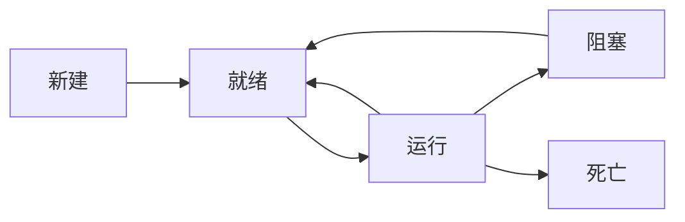

[TOC]

### 多线程

优点：提升程序性能的一种方式，可以充分利用 CPU 的使用率，使程序的运行效率更高

缺点：需要更多的内存空间，可能会有数据不一致的情况（线程不安全），可能存在资源竞争造成死锁的情况

#### 相关概念

##### 串行&并发&并行

* 串行：一个事情完成后才能做下一件事

* 并发：单核 CPU，在一个时间段内有多件事发生（交替执行）

* 并行：多核 CPU，在同一时刻可以做多件事

##### 进程&线程

* 进程：拥有独立的内存空间，是计算机正在运行的一个独立的应用程序（进程是动态的，若没有应用程序运行，则不存在进程）
* 线程：共用进程的内存空间，每个线程的执行都是独立的，线程是组成进程的基本单位，线程依赖于进程的启动，可以完成特定的功能，一个进程是由一个或多个线程组成的

##### 多线程

线程的并发，在一个时间段内多个线程交替执行，系统会为每个线程分配 CPU 资源，在不同的时间段 CPU 被不同的线程占用，由于占用时间短，线程的执行速度又很快，所以看起来像是同时执行

#### 创建线程

1. 实现 Runnable 接口

   ```java
   public class MyRunnable implements Runnable {
   
       @Override
       public void run() {
   
           for (int i = 0; i < 100; i++) {
               System.out.println("myRunnable 线程执行：" + i);
           }
       }
   
       public static void main(String[] args) {
   
           MyRunnable myRunnable = new MyRunnable();
   
           Thread thread1 = new Thread(myRunnable);
           Thread thread2 = new Thread(myRunnable);
   
           thread1.start();
           thread2.start();
       }
   }
   ```

2. 继承 Thread 类（不推荐使用，因为 Java 是单继承的，继承了 Thread 就不能继承其它的类了）

   ```java
   public class MyThread extends Thread {
   
       @Override
       public void run() {
   
           for (int i = 0; i < 100; i++) {
               System.out.println("myThread 线程执行：" + i);
           }
       }
   
       public static void main(String[] args) {
   
           MyThread thread1 = new MyThread();
           MyThread thread2 = new MyThread();
   
           thread1.start();
           thread2.start();
       }
   }
   ```

   实际 Thread 类也实现了 Runnable 接口，Thead 表示线程，Runnable 表示线程中要执行的任务内容

   启动线程需要调用 Thread 类的 start() 方法，而不是 run() 方法，start() 表示线程的启动，是 Thread 类的，而 run() 是 Runnable 接口中的，表示任务的执行，单独使用 run() 不会使线程去争夺 CPU 资源

3. 实现 Callable 接口，重写 call 方法

   ```java
   public class MyCallable implements Callable {
   
       @Override
       public Object call() throws Exception {
           return "Callable";
       }
   
       public static void main(String[] args) throws ExecutionException, InterruptedException {
   
           MyCallable myCallable = new MyCallable();
           FutureTask futureTask = new FutureTask(myCallable);
   
           Thread thread = new Thread(futureTask);
           thread.start();
   
           System.out.println(futureTask.get());
       }
   }
   ```

   Callable 接口与 Runnable 接口的区别在于：Callable 可以有返回值；可以抛出异常；Callable 需要 FutureTask 包装（FutureTask 实现了 RunnableFuture 的接口，RunnableFuture 又继承了 Runnable 接口）

#### 线程的五个状态



1. **新建（New）**
   线程对象被创建后就进入了新建状态。
   Thread thread = new Thread()

2. **就绪状态（Runnable）**
   也被称为“可执行状态”。线程对象被创建后，其他线程调用了该对象的start()方法，从而启动该线程。
   thread.start() ; 处于就绪状态的线程随时可能被CPU调度执行。

3. **运行状态（Running）**
   线程获取 CPU 资源进行执行，执行 run() 方法。需要注意的是，线程只能从就绪状态进入到运行状态，也可以从运行状态直接进入到就绪状态（通过执行 yield() 方法）；线程失去 CPU 资源以后直接进入到就绪状态

   thread.run()

4. **阻塞状态（Blocked）**
   阻塞状态是线程因为某种原因放弃CPU使用权限，暂时停止运行。直到线程进入就绪状态，才有机会进入运行状态。阻塞的三种情况：

     1. 等待阻塞，通过调用线程的wait()方法，让线程等待某工作的完成
     2. 同步阻塞，线程在获取synchronized同步锁失败（因为锁被其他线程占用）
     3. 其它阻塞，通过调用线程的sleep()或join()或发出了I/O请求时，线程会进入到阻塞状态。当sleep()状态超时、join()等待线程终止或超时、或者I/O处理完毕时，线程重新转入就绪状态。

   注意：阻塞的线程被唤醒后只能进入就绪状态，不能直接进入运行状态
   
5. **死亡状态（Dead）**
   线程执行完了或因异常退出了run()方法，该线程结束生命周期。

#### 线程调度

* **sleep()**（线程休眠，单位为毫秒）

  `Thread.sleep(1000) //使当前线程休眠一秒`

  使当前线程休眠，进入阻塞状态，让出CPU给其它线程，不释放锁，休眠时间到返回到就绪状态

  sleep() 是 Thread 类的一个 static native 静态本地方法

* **join()** （线程合并）

  在甲线程中调用乙线程的 join() 方法后，乙线程将独占 CPU ，甲线程进入阻塞状态；乙线程执行完毕后，甲线程进入就绪状态，等待CPU 调度运行。（相当于乙线程合并到了甲线程中，两者串行执行）

  **join(long millis)** 表示线程独占 CPU 持续的时间，超时后两个线程都变为就绪状态继续并发执行

  ```java
  public class MyJoin implements Runnable {
  
      @Override
      public void run() {
  
          for (int i = 0; i < 100; i++) {
              System.out.println("myRunnable 线程执行：" + i);
          }
      }
  
      public static void main(String[] args) throws InterruptedException {
  
          MyJoin myJoin = new MyJoin();
          Thread thread = new Thread(myJoin);
  
          // thread 线程启动，开始和 main 线程交替执行
          thread.start();
          for (int i = 0; i < 10; i++) {
              if (i == 5) {
                  System.out.println("MyJoin 线程开始执行");
                  // main 线程阻塞，thread 线程获得（不是独占） CPU 一直到执行完毕
                  thread.join();
              }
              //一开始交替运行，后来被阻塞直到 thread 线程执行完，获得 CPU 后继续运行
              System.out.println("main 线程执行：" + i);
          }
      }
  }
  ```

* **yield()** （线程礼让）

  当前线程暂停抢占 CPU 资源 ，让给相同优先级或更高优先级的线程执行，不释放锁，线程会直接转为就绪状态

  yield() 是Thread 类的一个 static native 静态本地方法

  ```java
  public class MyYield implements Runnable {
  
      @Override
      public void run() {
  
          for (int i = 0; i < 100; i++) {
              System.out.println("myYield 线程执行：" + i);
          }
      }
  
      public static void main(String[] args) {
  
          MyYield myYield = new MyYield();
          Thread thread = new Thread(myYield);
  
          thread.start();
          for (int i = 0; i < 10; i++) {
              if (i == 5) {
                  // 当 i=5 时，main线程暂停一下，myYield 线程会获取 CPU 资源继续执行
                  System.out.println("main 线程 yield");
                  Thread.yield();
              }
              System.out.println("main 线程执行：" + i);
          }
      }
  }
  ```

* **wait()** （线程等待）

  执行对象的 wait() 方法，会释放占用当前对象的线程的锁标记，存入对象的等待池中，进入阻塞状态，直到 wait() 超时或者其它线程调用资源的notify()、notifyAll()；

  线程执行对象的 wait() 方法时，必须拥有当前对象的锁，否则会抛出 `IllegalMonitorStateException`异常；所以 wait() 肯定是在同步代码块中

  wait() 是 Object 类的一个 final 普通方法（防止被重写）

  ```java
  public class MyWait {
  
      public synchronized void run(int i) {
  
          if (i == 5) {
              try {
                  this.wait();
              } catch (InterruptedException e) {
                  e.printStackTrace();
              }
          }
          try {
              TimeUnit.SECONDS.sleep(1);
          } catch (InterruptedException e) {
              e.printStackTrace();
          }
          System.out.println("run: " + i);
      }
      
      public static void main(String[] args) {
  
          MyWait myWait = new MyWait();
          new Thread(() -> {
              for (int i = 0; i < 10; i++) {
                  myWait.run(i);
              }
          }).start();
      }
  
  }
  ```

* **notify() & notifyAll()**

  当线程调用了对象的 notify() 方法，则会随机唤醒一个处于该对象的等待池中的线程

  notifyAll() 会唤醒该对象等待池中所以的对象；重新进入就绪状态等待获取 CPU 资源和对象锁

  notify() 容易造成死锁，因为 notify() 只能唤醒一个线程，而这个线程执行完毕后并没有唤醒其它在等待池中的线程，就会造成所有线程都处于一个等待的状态，造成死锁

  ```java
  public class MyNotify {
  
      public synchronized void run(int i) {
  
          if (i == 6) {
              try {
                  this.wait();
              } catch (InterruptedException e) {
                  e.printStackTrace();
              }
          }
          try {
              TimeUnit.SECONDS.sleep(1);
          } catch (InterruptedException e) {
              e.printStackTrace();
          }
          System.out.println("run: " + i);
      }
  
      public synchronized void notifyRun() {
          this.notify();
      }
  
      public static void main(String[] args) {
  
          MyNotify myNotify = new MyNotify();
          
          new Thread(() -> {
              for (int i = 0; i < 10; i++) {
                  myNotify.run(i);
              }
          }).start();
  
          new Thread(() -> {
              try {
                  TimeUnit.SECONDS.sleep(8);
              } catch (InterruptedException e) {
                  e.printStackTrace();
              }
              myNotify.notifyRun();
          }).start();
      }
  }
  ```

#### 线程同步

> 并发是关于正确有效地控制对共享资源的访问；并行是使用额外的资源来更快地产生结果。 -- On Java8

控制线程按照顺序去访问（读写）共享资源，这就是线程同步；线程同步可以保证数据的正确性

* 线程不同步的例子

  ```java
  public class MyNotSync implements Runnable {
  
      private static int num = 0;//共享资源
  
      @Override
      public void run() {
          num++;
          System.out.println(Thread.currentThread().getName() + "是第" + num + "个访问的线程");
  
      }
  
      public static void main(String[] args) {
  
          //多个线程共享 mySync 任务
          MyNotSync mySync = new MyNotSync();
  
          for (int i = 1; i <= 10; i++) {
              Thread thread = new Thread(mySync, "线程" + i);
              thread.start();
          }
      }
  }
  ```

  创建十个线程去访问 num，并记录访问的顺序；如果没有线程同步的话，会导致访问的顺序错乱

* 线程同步的例子

  ```java
  public class MySync implements Runnable {
  
      private static int num = 0;
  
      @Override
      public synchronized void run() {
          num++;
          System.out.println(Thread.currentThread().getName() + "是第" + num + "个访问的线程");
      }
  
      public static void main(String[] args) {
  
          //多个线程共享 mySync 任务
          MySync mySync = new MySync();
  
          for (int i = 1; i <= 10; i++) {
              Thread thread = new Thread(mySync, "线程" + i);
              thread.start();
          }
      }
  }
  ```

  使用 synchronized 关键字锁住共享任务 run()

  当失去 CPU 资源时其他线程不能执行插入执行被 synchronized 关键字修饰的代码块

##### synchronized

`synchronized` 是 Java 中的一个关键字，是一种同步锁，用来修饰需要同步的资源，可以用来修饰以下：

* **代码块**， `synchronized(Object) { }` ，取决于 Object 的性质；
* **方法**，作用于调用这个方法的对象
* **静态方法**，作用于这个类的所有对象
* **类**，作用于这个类的所有对象

被 `synchronized`修饰的作用：

1. 当一个线程访问一个对象中被 synchronized 修饰的部分时，其它试图访问该对象的线程将被阻塞，直到当前线程执行完毕被 synchronized 修饰的部分并释放锁
2. 当一个线程访问一个对象中被 synchronized 修饰的部分时，其它线程仍然可以访问该对象中没有被 synchronized 作用的部分（代码块和方法）

注意问题：

1. synchronized 不能用来修饰：静态变量、局部变量、静态代码块、接口、抽象方法
2. synchronized 不能被继承，子类中需要的话需要重新声明

##### 死锁

死锁产生的四个必要条件

1. 互斥使用：当资源被一个线程使用(占有)时，别的线程不能使用。
2. 不可抢占：资源请求者不能强制从资源占有者手中夺取资源，资源只能由资源占有者主动释放。
3. 请求和保持：即当资源请求者在请求其他的资源的同时保持对原有资源的占有。
4. 循环等待：即存在一个等待队列：P1占有P2的资源，P2占有P3的资源，P3占有P1的资源。这样就形成了一个等待环路。

哲学家就餐问题，n 个人，n 根筷子，每个人有两根筷子才能吃饭，若每个人同时只获得一根筷子，则互相等待造成死锁

```java
public class MyDeadlock implements Runnable {

    //筷子编号
    private final int num;

    //筷子资源，用 static 修饰，类变量，表示各有一份
    private static final Object chopsticks1 = new Object();
    private static final Object chopsticks2 = new Object();

    //构造函数，指定哪个哲学家先拿到哪只筷子
    public MyDeadlock(int num) {
        this.num = num;
    }

    //num = 1 时，拿到 chopsticks1，等待 chopsticks2
    //num = 2 时，拿到 chopsticks2，等待 chopsticks1
    @Override
    public void run() {

        if (num == 1) {
            System.out.println(Thread.currentThread().getName() + "拿到了 chopsticks1，等待 chopsticks2");
            synchronized (chopsticks1) {
                try {
                    Thread.sleep(100);
                } catch (InterruptedException e) {
                    e.printStackTrace();
                }
                synchronized (chopsticks2) {
                    System.out.println(Thread.currentThread().getName() + "用餐完毕！");
                }
            }
        }
        if (num == 2) {
            System.out.println(Thread.currentThread().getName() + "拿到了 chopsticks2，等待 chopsticks1");
            synchronized (chopsticks2) {
                try {
                    Thread.sleep(100);
                } catch (InterruptedException e) {
                    e.printStackTrace();
                }
                synchronized (chopsticks1) {
                    System.out.println(Thread.currentThread().getName() + "用餐完毕！");
                }
            }
        }

    }

    public static void main(String[] args) {

        MyDeadlock myDeadlock1 = new MyDeadlock(1);
        MyDeadlock myDeadlock2 = new MyDeadlock(2);

        new Thread(myDeadlock1, "哲学家1号").start();
        new Thread(myDeadlock2, "哲学家2号").start();

    }
}
```


##### 重入锁（ReentrantLock）

ReentrantLock 是 对 synchronized 的升级

ReentrantLock 通过 new 关键字创建，

区别：

* synchronized 是关键字；基于 JVM 实现；添加关键字自动上锁，上锁部分执行完毕后自动释放锁；可以锁定方法或代码块；synchronized 不可被中断
* ReentrantLock 是 JDK 实现的类；在 java.util.concurrent 包下；可以多次上锁、解锁；可以设置等待时间；只能锁定代码块；可以使用 lockInterruptibly() 方法中断锁

买票案例

```java
public class MyTicket implements Runnable {

    //剩余票数
    private int ticketCount = 20000;
    //卖出票数
    private int selledCount = 0;

    private final Lock lock = new ReentrantLock();

    @Override
    public void run() {

        while (ticketCount > 0) {
            lock.lock();//锁定 开始卖出一张票

            if (ticketCount == 0)//判断一下余票数量，若不为0则售票员线程开始卖票
                return;
            ticketCount--;
            try {
                Thread.sleep(1);
            } catch (InterruptedException e) {
                e.printStackTrace();
            }
            selledCount++;
            System.out.printf("%s卖出了第%s张票\n", Thread.currentThread().getName(), selledCount);

            lock.unlock();// 一张票卖完，解锁
        }

    }

    public static void main(String[] args) {

        MyTicket myTicket = new MyTicket();

        Thread sell01 = new Thread(myTicket);
        sell01.setName("售票员1号");
        Thread sell02 = new Thread(myTicket);
        sell02.setName("售票员2号");

        sell01.start();
        sell02.start();
    }
}
```

#### JUC 并发编程

java.util.concurrent 中存放了 Java 并发编程的相关的 API

并发编程可以充分利用 CPU 的资源，将计算机的性能发挥到极致

* 垂直扩展：提高单机处理能力（更换性能更好的 CPU，增加 CPU 核心数、提升内存等）

* 水平扩展：增加机器数量（分布式、集群）

  集群：每台机器所处理的任务都相同，通过增加服务器的数量来提高并发能力

  分布式：将整个系统拆分成不同的模块，交给不同的服务器来运行

##### 常用 JUC API

CopyOnWriteArrayList、CountDownLatch、CyclicBarrier、Semaphore

###### `CopyOnWriteArrayList` 

ConcurrentModificationException 并发修改异常，对线程对 ArrayList 同时进行读写操作时，会产生此异常 

写时复制（线程安全的List）当我们往一个容器中添加元素的时候，不是直接操作这个容器，而是将原来的容器先复制一份，往复制出来的新容器中添加元素，添加完毕后，再将原容器的引用指向新容器（目的是问了防止读阻塞，但是会出现读写不一致的问题，使用 volatile 关键字解决），以此来解决并发修改异常（实际上还是使用了 ReentrantLock 加锁解决线程安全问题），实际上就是实现了读写分离（防止读阻塞）。

###### `CountDownLatch` 

减法计数器

```java
public class MyCountDownLatch {

    public static void main(String[] args) {

        CountDownLatch count = new CountDownLatch(50);

        new Thread(() -> {
            for (int i = 0; i < 50; i++) {
                System.out.println("线程一执行");
                count.countDown();
            }
        }).start();

        try {
            count.await(); //减法计数器设置的值减完之前，其它线程处于阻塞状态
        } catch (InterruptedException e) {
            e.printStackTrace();
        }

        new Thread(() -> {
            for (int i = 0; i < 50; i++) {
                System.out.println("线程二执行");
            }
        }).start();
    }
}
```

使用减法计数器的线程会在计数器清零前独占 CPU 运行，减法计数器设置的值减完之前，其它线程处于阻塞状态；减法计数器清零以后，唤醒其它的等待线程进入到就绪状态，等待获取 CPU 资源运行

`countDown()` :计数器减一

`await()`: 使计数器产生作用（先阻塞其它线程，计数器清零后唤醒其它线程）

注意：使用计数器的线程执行的总次数一定要大于等于计数器数，否则会导致计数器不能清零，不能唤醒其它线程，导致死锁

###### `CyclicBarrier`

加法计数器

```java
public class MyCyclicBarrier {
    
    public static void main(String[] args) {

        CyclicBarrier cyclicBarrier = new CyclicBarrier(10, () -> {
            System.out.println("放行");
        });

        for (int i = 0; i < 40; i++) {

            final int temp = i;
            new Thread(() -> {
                System.out.println(temp);
                try {
                    cyclicBarrier.await();//加法计数器执行一次
                } catch (InterruptedException | BrokenBarrierException e) {
                    e.printStackTrace();
                }
            }).start();
        }
    }
}
```

当 await() 被调用指定的次数后，加法计数器清零，cyclicBarrier 中的线程被执行
若 await() 执行的次数不等于加法计数器的倍数，则加法计数器所持有的线程处于阻塞状态

###### `Semaphore` 

计数信号量

```java
public class MySemaphore {

    public static void main(String[] args) {

        Semaphore semaphore = new Semaphore(5);//初始化许可的数量

        for (int i = 1; i <= 15; i++) {
            new Thread(() -> {
                try {
                    semaphore.acquire();//当前线程尝试获取访问许可
                    System.out.println(Thread.currentThread().getName() + "开始访问");
                    Thread.sleep(2000);//休眠两秒，模拟其它操作
                } catch (InterruptedException e) {
                    e.printStackTrace();
                } finally {
                    System.out.println(Thread.currentThread().getName() + "访问结束");
                    semaphore.release();//释放许可
                }
            }, "线程" + i).start();
        }
    }
}
```

限制访问资源的线程数量；初始化访问资源的许可数量、获取许可、释放许可

##### 读写锁

ReadWriteLock 接口，实现类为 ReentrantReadWriteLock，可以多个线程同时读，但是同一时刻只能有一个线程写入（读锁是一个共享锁，写锁是一个独占锁）

* 共享锁（读锁）

  读取数据时，不允许其他事务对当前数据进行修改操作，从而避免”不可重读”的问题的出现

* 独占锁（写锁、排它锁）

  在修改数据时，不允许其他事务对当前数据进行修改和读取操作，从而可以有效避免”脏读”问题的产生

 ```java
 public class MyReadWriteLock {
 
     public static void main(String[] args) {
         Cache cache = new Cache();
 
         //五个线程写操作
         for (int i = 0; i < 5; i++) {
             final int temp = i;
             new Thread(() -> {
                 cache.write(temp, String.valueOf(temp));
             }).start();
         }
 
         //五个线程读操作
         for (int i = 0; i < 5; i++) {
             final int temp = i;
             new Thread(() -> {
                 cache.read(temp);
             }).start();
         }
     }
 }
 
 class Cache {
 
     private final Map<Integer, String> cache = new HashMap<>();
 
     private final ReadWriteLock readWriteLock = new ReentrantReadWriteLock();
 
     public void write(Integer key, String value) {
         readWriteLock.writeLock().lock();
         
         System.out.println("write key: " + key + " value:" + value);
         cache.put(key, value);
         System.out.println("write done: " + key);
         
         readWriteLock.writeLock().unlock();
     }
 
     public void read(Integer key) {
         readWriteLock.readLock().lock();
         
         System.out.println("read key:" + key);
         System.out.println("read done value:" + cache.get(key));
         
         readWriteLock.readLock().unlock();
     }
 
 }
 ```

##### 线程池

存放线程对象的缓冲池，为了节约资源；预先创建一定数量的线程对象，放入缓冲池中，需要的时候取出使用，使用完毕后放回缓冲池中，供下一次使用

优势

* 提高线程的利用率
* 提高程序的响应速度（没有创建线程时的耗时）
* 便于统一管理线程对象
* 可以控制程序的最大并发数

###### 7大核心参数

1. corePoolSize： 核心池的大小（默认可用线程的数量）
2. maximumPoolSize： 线程池的最大线程数（所有线程总数）
3. keepAliveTime：线程工厂产生的线程中空闲线程的存活时长
4. unit： keepAliveTime 的时间单位
5. workQueue：阻塞队列
6. threadFactory：线程工厂（生成线程）
7. handler：拒绝任务策略

执行过程：当核心池满时，新增的线程会在阻塞队列中等待；当阻塞队列满时，会调用线程工厂新增线程，直到达到最大线程数；达到最大线程数后，再新增线程会触发拒绝策略；当线程工厂所产生的线程的任务执行完毕后，存活指定的时间后，若没有新的任务，则自动销毁

```java
public class MyExecutorService {

    public static void main(String[] args) {
        ExecutorService executorService = new ThreadPoolExecutor(
                2, //核心线程数
                3, //最大线程数
                1L, //存活时间
                TimeUnit.SECONDS, //时间单位
                new ArrayBlockingQueue<>(2), //阻塞队列数
                Executors.defaultThreadFactory(), //线程工厂 当阻塞队列数和核心线程数饱和时，线程工厂开始创建新的线程，直到达到线程池最大线程数，再添加新的线程则触发拒绝策略
                new ThreadPoolExecutor.AbortPolicy()); //拒绝策略 （ThreadPoolExecutor.AbortPolicy()为直接抛异常）


        for (int i = 0; i < 5; i++) {

            executorService.execute(() -> {
                System.out.println(Thread.currentThread().getName() + "run");
                try {
                    Thread.sleep(10);
                } catch (InterruptedException e) {
                    e.printStackTrace();
                }
                System.out.println(Thread.currentThread().getName() + "end");
            });
        }
        executorService.shutdown();

    }

}
```

###### 快速创建线程池（不可控）

1. `Executors.newSingleThreadExecutor()`创建一个单例线程池，里面只有一个线程对象
2. `Executors.newFixedThreadPool(int num)`快速创建一个指定数量的线程池 核心数和最大数一样
3. `Executors.newCachedThreadPool()`由电脑配置自动分配线程数量

```java
public class MyExecutors {

    public static void main(String[] args) {

//        ExecutorService executors = Executors.newSingleThreadExecutor();//创建一个单例线程池，里面只有一个线程对象

//        ExecutorService executors = Executors.newFixedThreadPool(5);//快速创建一个指定数量的线程池 核心数和最大数一样

        ExecutorService executors = Executors.newCachedThreadPool();//由电脑配置自动分配线程数量
        for (int i = 0; i < 10; i++) {
            final int temp = i;
            executors.execute(() -> {
                System.out.println(Thread.currentThread().getName() + temp);
            });
        }

        executors.shutdown();
    }
}
```

###### 线程池的拒绝策略

* AbortPolicy                 直接抛出异常
* DiscardPolicy              放弃任务，不抛出异常
* DiscardOldestPolicy  尝试与阻塞队列中最前面的任务去争夺，不抛出异常
* CallerRunPolicy          交给调用方处理

#### 常见问题

1. wait()、 sleep()、yield() 的区别
    * wait() 属于 Object 中的方法；执行对象 wait() 的线程会释放占用的对象和 CPU 资源，并进入阻塞状态，直到 wait() 超时或其它线程调用 notify() 或 notifyAll() 方法才能重新进入就绪状态等待执行
    * sleep() 属于 Thread 中的方法；作用于占用此对象的当前线程；使当前线程阻塞指定的时间并释放 CPU 资源，同时不会释放占用当前对象的锁，使得其它需要此对象的线程只能等待
    * yield() 属于 Thread 中的方法；使当前线程暂停执行并释放 CPU 资源，转为就绪状态，不释放锁；相同或更高优先级的线程可以抢占 CPU 资源
2. synchronized 锁定的到底是什么？
    * 若 synchronized 修饰的是非静态方法，则锁定的是调用此方法的当前对象
    * 若 synchronized 修饰的是静态方法，则锁定的是调用此方法的所有对象
    * 若 synchronized 修饰的是类，则锁定的是调用此方法的所有对象
    * 若使用 synchronized (Obeject) 修饰代码块，则取决于 Object。若各线程中的 Object 是同一个（在内存中），则各个线程保持了线程同步

