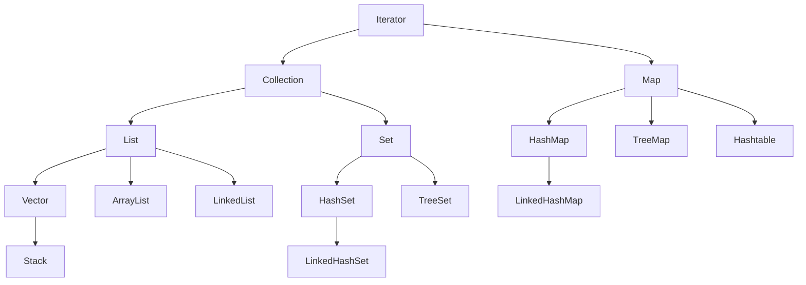

[TOC]

### 集合

数组只能存储指定数量的元素

集合存储的元素的数量和类型都是动态的

集合框架简化图：



#### Iterator（接口）

迭代器，输出集合元素的接口， 主要用于集合的遍历

#### Collection（接口）

主要定义iterator方法、equals和hashCode方法和一些其它待实现的方法

####  List（接口）

List 是可变长数组的接口，常用的实现类有：ArrayList、LinkedList、Vector、Stack；其中 Vector 是线程安全的

##### ArrayList

ArrayList 是基于索引的数据结构，长度可变的数组，在内存中分配连续的空间；是线程不安全的；ArrayList 默认重写了 toString()

* 优点：根据索引查询元素的效率高
* 缺点：插入元素的效率低（需要完成元素的移动和拷贝）

ArrayList 新建时默认容量为10 ，每次扩容为原容量的1.5倍

```java
public class MyArrayList {
    public static void main(String[] args) {
        List<Integer> list = new ArrayList<>();//创建 ArrayList

        list.add(1);//添加元素
        list.add(1, 2);//在指定的位置插入元素，不能超过当前元素的大小
        list.remove(Integer.valueOf(3));//移除指定的元素
        list.remove(0);//移除索引位置上的元素
        System.out.println(list.size());//获取元素的大小

        Iterator<Integer> iterator = list.iterator();//使用 iterator 遍历元素
        while (iterator.hasNext()) {
            System.out.println(iterator.next());
        }

        for (Integer value : list) {//使用增强型 for 循环遍历元素
            System.out.println(value);
        }
    }
}
```

##### LinkedList

LinkedList 是基于双向链表的数据结构，在内存中不连续分配，通过存储彼此的引用关联起来；是线程不安全的

* 优点：插入移除元素效率较高（其实并不高，因为需要做遍历操作）
* 缺点：遍历查询元素效率较低 （get() 方法的底层还是使用了遍历查询）

##### Vector

Vector 原理和用法与 ArrayList 相当，但 Vector 是线程安全的

##### Stack

Stack 是 Vector 的子类，实现了栈数据结构，先进后出、后进先出，是线程不安全的（ConcurrentStack是线程安全的）

#### Set（接口）

Set 用于存储唯一元素的接口，默认根据内存地址（引用）判断元素是否相同；可以通过重写元素的 equals() 和 hashCode() 方法修改元素的相同判断逻辑

##### HashSet

HashSet 是基于 HashMap 实现的，用于存储一组无序且唯一的元素，只能通过遍历进行元素的访问（因为存储顺序和访问顺序可能不一致）

##### LinkedHashSet

LinkedHashSet 存储一组有序且唯一的元素，可以通过下标访问任意元素（本质还是遍历元素，这里的有序指的是存储顺序和访问顺序一致）

##### TreeSet

TreeSet 存储一组有序且唯一的元素（这里的有序指的是元素本身的大小，默认按照升序排列；元素可以通过继承 Comparable 接口，实现 compareTo 方法定义排序逻辑），添加到 TreeSet 集合中的元素必须继承 Compareable 接口，实现 compareTo() 方法

```java
public class MyTreeSet {

    public static void main(String[] args) {

        Set<Node> treeSet = new TreeSet<>();

        Node node1 = new Node(1);
        Node node2 = new Node(2);
        Node node3 = new Node(3);

        treeSet.add(node3);
        treeSet.add(node2);
        treeSet.add(node1);

        System.out.println(treeSet);
    }
}

//存储元素需要继承 Comparable 实现 compareTo 方法
class Node implements Comparable<Node> {

    public int value;

    public Node(int value) {
        this.value = value;
    }

    //规定排序规则
    //返回 -1表示小于，0表示等于，1表示大于
    @Override
    public int compareTo(Node o) {
        if (this.value < o.value) {
            return -1;
        } else if (this.value == o.value) {
            return 0;
        } else {
            return 1;
        }
    }

    @Override
    public String toString() {
        return "Node{" +
                "value=" + value +
                '}';
    }
}
```

#### Map（接口）

Map 存储一组键值对 key-value；key 具有唯一性，不可以重复；value 可以重复

键值对能不能存 null 取决于有没有其余作用，如 TreeMap 需要根据 key 继承的 Comparable 接口排序，所以不能存 null

##### HashMap

HashMap 存储一组无序的、key 不可重复、value 可以重复的元素；继承自 AbstractMap 抽象类

HashMap 可以存入 null 键和 null 值

HashMap 的默认容量为16，达到阈值（加载因子为0.75，元素数量即达到容量的0.75倍）时，会扩容为原来的2倍；底层数组的容量是2的整数次幂

底层结构：

###### 关键概念

* 哈希（散列、Hash）

  是一种压缩映射，将任意长度的输入通过哈希算法转换成固定长度的输出，不同的输入可能会有相同的输出（所以hashCode()不能用来判断对象是否相同）；用于分散数据的存储位置，使数据散列在不同的哈希桶中

* 哈希码（HashCode）

  可以调用对象的 hashCode() 方法获得，是一串固定长度的整型的数字，可以由 hash 函数（直接取余法、乘法取整法、平方取中法等）生成

* 哈希表（散列表、hash table）

  是根据关键码值(Key value)而直接进行访问的数据结构；通过把关键码值映射到表中一个位置来访问记录，以加快查找的速度。这个映射函数叫做散列函数，存放记录的数组叫做散列表。

* 哈希桶（HashBucket）

  当通过不同的 key 计算出相同的 hashvalue 时，就称作**哈希冲突**（解决方法有：链地址法、开放地址法、再哈希法）；

  解决哈希冲突，引用哈希桶；本质就是将相同的 hashvalue 的 key 存放在同一个单向链表中（链地址法）；在查询数据时，先通过 key 索引到相应位置的桶，然后遍历桶中的链表，直到找到对应的 key 值

  哈希桶本质就是一个能够存储链表元素的数组

  最坏情况下所有 key 都对应同一个 hashvalue，那么就会退化成一个单向链表，造成其它桶的浪费，所以hash 函数的选择很关键；同时 JDK1.8 以后加入了红黑树，当链表的长度大于等于8时，则会转换为红黑树，以提高查询效率

* 红黑树（自平衡二叉树）

  红黑树是一种平衡二叉树，查询操作的平均时间复杂度为O(logn)

###### HashMap 源码解读

* HashMap() 构造器

  ```java
      //不会直接创建创建 hashbucket，而是先定义加载因子，扩容指标，规定元素数量达到容量的0.75倍时扩容（当调用 put() 方法添加元素时，才会创建数组，属于懒加载）
      static final float DEFAULT_LOAD_FACTOR = 0.75f;
      //构造器、获得加载因子
      public HashMap() {
          this.loadFactor = DEFAULT_LOAD_FACTOR; // all other fields defaulted
      }
  ```

* hash 哈希算法

  ```java
      //如果 key = null 时，hash 值为0
      //如果 key 不等于 null，则将 key 的 hashCode 与 hashcode>>>16（hashCode/2^16，hashCode 的高16位）作异或运算（相同为0，不同为1）
      static final int hash(Object key) {
          int h;
          return (key == null) ? 0 : (h = key.hashCode()) ^ (h >>> 16);
      }
  ```

  作用：hashCode 是一个 int 类型（32位）的整数，取值范围约等于-21亿~21亿，共有40多亿个hashCode，而初始化的数组长度为16，远远小于 hashCode 的值范围；所以需要将 hashCode 与自己的高16位进行异或运算，混合原始 hashCode 的高位和低位，加大低位的随机性（后续由于数组大小原因需要舍弃高位值，所以加大低位的随机性可以保证计算出的新的 hashCode 尽量保持唯一性），得到新的 hash 值

* resize() 初始化/扩容操作

  ```java
      final Node<K,V>[] resize() {
          //声明 Node 数组 oldTab 用于记录 hashBucket 原始的内容
          Node<K,V>[] oldTab = table;
          //声明 oldCap 记录 hashBucket 的原始长度
          int oldCap = (oldTab == null) ? 0 : oldTab.length;
          //声明 oldThr 记录扩容阈值，首次初始化时为 0
          int oldThr = threshold;
          //声明新的数组容量和新的阈值
          int newCap, newThr = 0;
          //判断 oldCap 原始长度是否大于0，若是则执行扩容操作
          if (oldCap > 0) {
              if (oldCap >= MAXIMUM_CAPACITY) {
                  threshold = Integer.MAX_VALUE;
                  return oldTab;
              }
              else if ((newCap = oldCap << 1) < MAXIMUM_CAPACITY &&
                       oldCap >= DEFAULT_INITIAL_CAPACITY)
                  newThr = oldThr << 1; // double threshold
          }
          //判断原始阈值 oldThr 是否大于 0，若是则将老的阈值 oldThr 赋值给新的容量 newCap
          else if (oldThr > 0) // initial capacity was placed in threshold
              newCap = oldThr;
          //若以上都不满足，则代表首次初始化数组
          else {               // zero initial threshold signifies using defaults
              //赋值给新的容量 newCap 默认初始容量 default initial capacity 为16
              newCap = DEFAULT_INITIAL_CAPACITY;
              //赋值给新的扩容阈值 newThr 默认初始容量*加载因子 16*0.75 为12
              newThr = (int)(DEFAULT_LOAD_FACTOR * DEFAULT_INITIAL_CAPACITY);
          }
          //判断此时扩容阈值 newThr 是否等于0
          if (newThr == 0) {
            	//计算扩容阈值赋给 ft
              float ft = (float)newCap * loadFactor;
            	//新的容量 newCap 小于最大容量并且 当前扩容阈值 ft 小于最大容量，则将扩容阈值设置成 Integer,MAX_VALUE 2147483647 （21亿左右）
              newThr = (newCap < MAXIMUM_CAPACITY && ft < (float)MAXIMUM_CAPACITY ?
                        (int)ft : Integer.MAX_VALUE);
          }
        	//让原始扩容阈值 threshold 等于新的扩容阈值
          threshold = newThr;
        	//创建新的数组并初始化新的容量
          @SuppressWarnings({"rawtypes","unchecked"})
          Node<K,V>[] newTab = (Node<K,V>[])new Node[newCap];
        	//将新的数组赋值给原始数组
          table = newTab;
        	//判断旧数组是否为 null
          if (oldTab != null) {
            	//若不为 null，则遍历原来的旧数组
              for (int j = 0; j < oldCap; ++j) {
                	//声明一个元素 Node e
                  Node<K,V> e;
                	//将当前元素赋值给 e，并判断是否为空
                  if ((e = oldTab[j]) != null) {
  										//若不为空，则先将旧数组当当前元素置为 null
                      oldTab[j] = null;
                    	//判断当前元素 e 是否存在链表结构
                      if (e.next == null)
                        	//若不存在，说明当前 hashBucket 中只有 e 一个元素
                        	//并重新计算 e 的 hashBucket 位置并添加进去
                          newTab[e.hash & (newCap - 1)] = e;
                    	//判断当前 e 是否是红黑树结构
                      else if (e instanceof TreeNode)
                        	//如果是红黑树结构
                          ((TreeNode<K,V>)e).split(this, newTab, j, oldCap);
                      else { // preserve order
                          Node<K,V> loHead = null, loTail = null;
                          Node<K,V> hiHead = null, hiTail = null;
                          Node<K,V> next;
                          do {
                              next = e.next;
                              if ((e.hash & oldCap) == 0) {
                                  if (loTail == null)
                                      loHead = e;
                                  else
                                      loTail.next = e;
                                  loTail = e;
                              }
                              else {
                                  if (hiTail == null)
                                      hiHead = e;
                                  else
                                      hiTail.next = e;
                                  hiTail = e;
                              }
                          } while ((e = next) != null);
                          if (loTail != null) {
                              loTail.next = null;
                              newTab[j] = loHead;
                          }
                          if (hiTail != null) {
                              hiTail.next = null;
                              newTab[j + oldCap] = hiHead;
                          }
                      }
                  }
              }
          }
        	//返回创建好的新数组
          return newTab;
      }
  ```

* put(K key, V value) 添加元素方法

  ```java
      //新增元素方法，调用了 putVal(hash(key), key, value, false, true) 方法
       public V put(K key, V value) {
          return putVal(hash(key), key, value, false, true);
      }
      //实际新增元素的方法
      //onlyIfAbsent（如果不存在才执行更新赋值操作） 判断是否执行覆盖更新操作，默认为 false，执行覆盖更新
      //evict（驱逐） 用于子类 LinkedHashMap，判断是否删除老旧元素
      final V putVal(int hash, K key, V value, boolean onlyIfAbsent, 
                     boolean evict) {
          //声明一个 Node 类型的数组 tab（实际成员变量 table 为哈希桶，通过 tab 引用 table 来进行操作）
          Node<K,V>[] tab; Node<K,V> p; int n, i;
          //如果 tab 为 null 或者 tab 长度为0，则调用 resize() 方法进行初始化和扩容操作（懒加载）
          if ((tab = table) == null || (n = tab.length) == 0)
              //使用 n 来记录数组的长度，首次初始化的长度为16
              n = (tab = resize()).length;
          //计算出待存入的索引 i，通过引用 p 来取出元素，并判断是否为 null（数组长度-1与 hash 进行按位与运算，可以保证获得的索引值小于等于当前哈希桶数组的长度）
          if ((p = tab[i = (n - 1) & hash]) == null)
              //若元素为 null（没有发生 hash 碰撞），则调用 newNode 方法创建新的 Node 添加进哈希桶
              tab[i] = newNode(hash, key, value, null);
          else {
              //若元素不为 null（发生了 hash 碰撞），则先声明一个新的 Node e 和一个新 k
              Node<K,V> e; K k;
              //判断数组中元素 p 的 hash、key 和待添加的元素的 hash 和 key 是否相等
              if (p.hash == hash &&
                  ((k = p.key) == key || (key != null && key.equals(k))))
                  //若相等，将引用 e 指向数组中的元素 p
                  e = p;
              //判断数组中的元素 p 是否是 TreeNode（红黑树）类型
              else if (p instanceof TreeNode)
                  //若数组中的元素 p 是 TreeNode 类型，则将 p 强转成 TreeNode 并把待添加的数据填充进去，并将节点返回给引用 e
                  e = ((TreeNode<K,V>)p).putTreeVal(this, tab, hash, key, value);
              else {
                  //如果 p 不是红黑树类型（则是链表），则开始遍历链表（此处实际为死循环，binCount 用于记录链表长度，因为是从0开始遍历的，所以此时链表长度应该是 binCount+1）
                  for (int binCount = 0; ; ++binCount) {
                      //找到链表中的最后一位并赋值给引用 e
                      if ((e = p.next) == null) {
                          //创建一个新的 Node，把数据填充进去并加入到链表的末尾
                          p.next = newNode(hash, key, value, null);
                          //判断此时链表长度是否大于等于8
                          if (binCount >= TREEIFY_THRESHOLD - 1) // -1 for 1st
                            //若大于等于8，则将此链表装换成 TreeNode（红黑树）  
                            treeifyBin(tab, hash);
                          //退出遍历循环
                          break;
                      }
                      //若当前遍历的元素 e 的 hash、key 等于待添加元素的 hash、key 或者 key 不为 null 且两个 key 地址相等，则说明当前链表中已经存在此 key 值，直接退出循环
                      if (e.hash == hash &&
                          ((k = e.key) == key || (key != null && key.equals(k))))
                          break;
                      //引用指向下一个元素
                      p = e;
                  }
              }
              //判断当前待覆盖的元素是否为空
              if (e != null) { // existing mapping for key
                  //若不为空，则将旧的 value 赋值给 oldValue
                  V oldValue = e.value;
                  //更新集合中对应 key 的 value 值
                  if (!onlyIfAbsent || oldValue == null)
                      e.value = value;
                  afterNodeAccess(e);
                  //将旧值返回
                  return oldValue;
              }
          }
          //修改次数+1
          ++modCount;
          //更新大小并判断是否需要扩容
          if (++size > threshold)
              //执行扩容操作
              resize();
          //空函数，用作 LinkedHashMap 重写使用
          afterNodeInsertion(evict);
          return null;
      }
  ```


###### 流程概述

* 新增操作概述
    1. new HashMap() 为懒加载，并不会直接创建，而是先设置默认加载因子 DEFAULT_LOAD_FACTOR，为0.75
    2. put() 方法存入元素时，会先计算好 hash 值，再调用 putVal() 方法执行实际存储逻辑
    3. putVal() 方法
        1. 会先判断哈希桶数组是否为 null，为 null 则调用 resize 方法创建新的数组并返回
        2. 计算待存入元素的在数组中的索引，并判断当前索引位置是否为 null，若为 null 则直接将元素放入（没有发生哈希碰撞）
        3. 若当前索引位置不为 null（发生了哈希碰撞），则开始遍历哈希桶当前索引位置上的链表或者红黑树
        4. 若遍历到 null 则证明当前哈希桶位置上没有相同的 hash、key 元素，则将新元素直接添加进去即可，并新增修改次数+1，同时根据扩容阈值判断当前数组是否需要扩容（新增操作）
        5. 若获得当前遍历到的元素，则根据判断条件将新的 value 替换进去，并将 oldValue 直接返回（更新操作）
        6. 遍历过程中如果发现当前链表长度大于或者等于 8，则将此链表转换成红黑树
* 扩容操作概述
    1.
* 删除操作概述

##### Hashtable

Hashtable 存储一组无序的、key 不可重复、value 可以重复的元素；是线程安全的；继承自 Dictionary 抽象类（开发不建议使用，效率过低，可以使用 ConcurrentHashMap 替代）

Hashtable 不允许存入 null 键和 null 值

Hashtable 默认容量为11，达到阈值时，会自动扩容为原来的2倍+1

##### TreeMap

TreeMap 存储一组有序的（按照 key 的排序规则 Compareable）、key 不可重复、value 可以重复的元素

TreeMap 不可以存 null 键，但是可以存 null 值（因为需要按照键来排序）


##### LinkedHashMap

LinkedHashMap 是一组有序的（按照存储顺序），key 不可重复、value 可以重复的元素

LinkedHashMap 可以存入 null 键和 null 值

#### 常见问题

1. LinkedList 和 ArrayList 的真实效率究竟是如何？

   插入位置分为三种情况：

    * 在头部插入数据：LinkedList 较快；LinkedList 刚开始遍历便可插入元素；ArrayList 需要拷贝原数组，还可能需要执行扩容操作
    * 在中部插入数据：ArrayList 可能较快；LinkedList 需要执行遍历操作，越往中间遍历越久
    * 在尾部插入数据：ArrayList 较快；ArrayList 需要移动的数据变少

   数据量大小两种情况（以100000条数据为分界点）：

    * 数据量大：ArrayList 插入操作优势更明显，ArrayList 的扩容次数变小
    * 数据量小：LinkedList 插入操作优势更明显，ArrayList 频繁插入可能需要多次扩容

   ArrayList 的耗时操作为扩容

   LinkedList 的耗时操作为遍历

   实际使用 Iterator 遍历集合时，LinkedList 的效率和 ArrayList 效率差别不会太大，因为 Iterator 会缓存节点的位置信息

2. 集合框架中有哪些实现类是线程安全的？

   Hashtable、Vector；不建议用，因为是早期提供的线程安全集合，效率较低；可以使用 JUC（java.concurrent.util）中的线程安全的集合 ConcurrentHashMap、CopyOnWriteArrayList 来替代

3. 怎样使元素具有可排序性？

   让元素继承 Comparable 接口实现 compareTo 方法使具有排序性

   tree 类的集合每次存入元素时，会将调用当前元素的 compareTo() 与集合中的其他元素作比较

   例如 A.compareTo(B)，会返回一个 int 类型的值，如果：

   -1： A < B

   0： A = B

   1： A > B

4. 为什么 Hashtale 不能用 null，但是 HashMap 可以呢？ 


