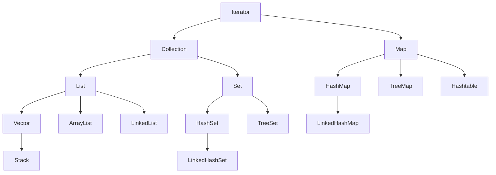

[TOC]

### 集合

数组只能存储指定数量的元素

集合存储的元素的数量和类型都是动态的

集合框架简化图：



#### Iterator（接口）

迭代器，输出集合元素的接口， 主要用于集合的遍历

#### Collection（接口）

####  List（接口）

List 是可变长数组的接口，常用的实现类有：ArrayList、LinkedList、Vector、Stack；其中 Vector 是线程安全的

##### ArrayList

ArrayList 是基于索引的数据结构，长度可变的数组，在内存中分配连续的空间；是线程不安全的；ArrayList 默认重写了 toString()

* 优点：根据索引查询元素的效率高
* 缺点：插入元素的效率低（需要完成元素的移动和拷贝）

ArrayList 新建时默认容量为10 ，每次扩容为原容量的1.5倍

```java
public class MyArrayList {
    public static void main(String[] args) {
        List<Integer> list = new ArrayList<>();//创建 ArrayList

        list.add(1);//添加元素
        list.add(1, 2);//在指定的位置插入元素，不能超过当前元素的大小
        list.remove(Integer.valueOf(3));//移除指定的元素
        list.remove(0);//移除索引位置上的元素
        System.out.println(list.size());//获取元素的大小

        Iterator<Integer> iterator = list.iterator();//使用 iterator 遍历元素
        while (iterator.hasNext()) {
            System.out.println(iterator.next());
        }

        for (Integer value : list) {//使用增强型 for 循环遍历元素
            System.out.println(value);
        }
    }
}
```

##### LinkedList

LinkedList 是基于链表的数据结构，在内存中不连续分配，通过存储彼此的引用关联起来；是线程不安全的

* 优点：插入移除元素效率高（其实并不高，因为需要做遍历操作）
* 缺点：遍历查询元素效率低 （get() 方法的底层还是使用了遍历查询）

##### Vector

Vector 原理和用法与 ArrayList 相当，但 Vector 是线程安全的

##### Stack

Stack 是 Vector 的子类，实现了栈数据结构，先进后出、后进先出，是线程不安全的（ConcurrentStack是线程安全的）

#### Set（接口）

Set 用于存储唯一元素的接口，默认根据内存地址（引用）判断元素是否相同；可以通过重写元素的 equals() 和 hashCode() 方法修改元素的相同判断逻辑

##### HashSet

HashSet 是基于 HashMap 实现的，用于存储一组无序且唯一的元素，只能通过遍历进行元素的访问（因为存储顺序和访问顺序可能不一致）

##### LinkedHashSet

LinkedHashSet 存储一组有序且唯一的元素，可以通过下标访问任意元素（本质还是遍历元素，这里的有序指的是存储顺序和访问顺序一致）

##### TreeSet

TreeSet 存储一组有序且唯一的元素（这里的有序指的是元素本身的大小，默认按照升序排列；元素可以通过继承 Comparable 接口，实现 compareTo 方法定义排序逻辑），添加到 TreeSet 集合中的元素必须继承 Compareable 接口，实现 compareTo() 方法

#### Map（接口）

Map 存储一组键值对 key-value；key 具有唯一性，不可以重复；value 可以重复

##### HashMap

HashMap 存储一组无序的、key 不可重复、value 可以重复的元素

##### Hashtable

Hashtable 存储一组无序的、key 不可重复、value 可以重复的元素；是线程安全的

##### TreeMap

TreeMap 存储一组有序的（按照 key 的排序规则 Compareable）、key 不可重复、value 可以重复的元素

##### LinkedHashMap

LinkedHashMap 是一组有序的（按照存储顺序），key 不可重复、value 可以重复的元素

#### 常见问题

1. LinkedList 和 ArrayList 的真实效率究竟是如何？

   插入位置分为三种情况：

   * 在头部插入数据：LinkedList 较快；LinkedList 刚开始遍历便可插入元素；ArrayList 需要拷贝原数组，还可能需要执行扩容操作
   * 在中部插入数据：ArrayList 可能较快；LinkedList 需要执行遍历操作，越往中间遍历越久
   * 在尾部插入数据：ArrayList 较快；ArrayList 需要移动的数据变少

   数据量大小两种情况：

   * 数据量大：LinkedList 插入操作优势更明显，ArrayList 的扩容、复制操作耗时明显
   * 数据量小：ArrayList 插入操作优势更明显，LinkedList 的 new Node() 操作耗时明显

2. 集合框架中有哪些实现类是线程安全的

   Hashtable、Vector；不建议用，因为是早期提供的线程安全集合，效率较低；可以使用 JUC（java.concurrent.util）中的线程安全的集合 ConcurrentHashMap、CopyOnWriteArrayList 来替代

