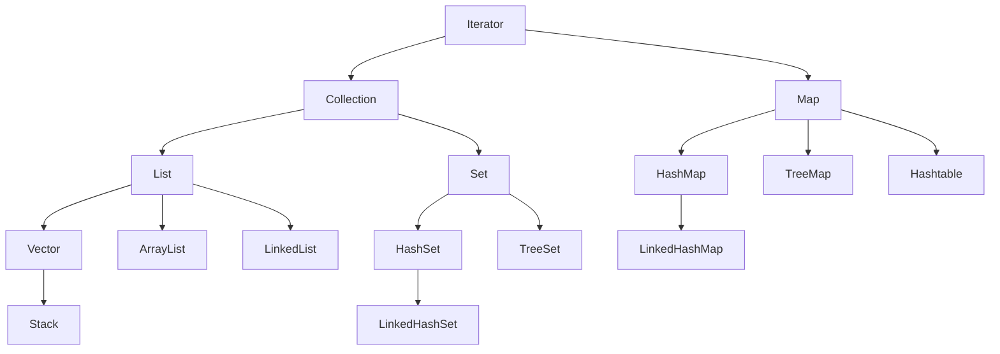

[TOC]

### 集合

数组只能存储指定数量的元素

集合存储的元素的数量和类型都是动态的

集合框架简化图：

#### Iterator（接口）

#### Collection（接口）

####  List（接口）

##### Vector

##### Stack

##### ArrayList

##### LinkedList

#### Set（接口）

##### HashSet

##### LinkedHashSet

##### TreeSet

#### Map（接口）

##### HashMap

##### LinkedHashMap

##### Hashtable

##### TreeMap

